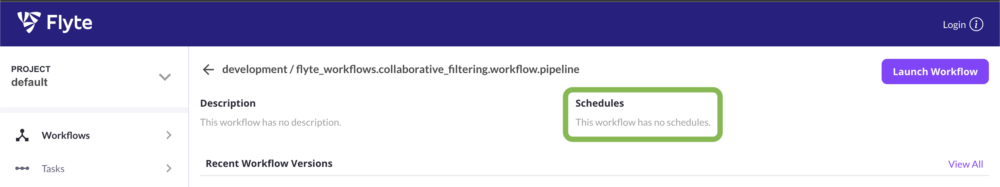
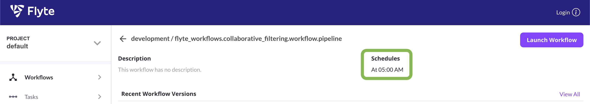

Workflow Cronjobs
========================

Activating a Cronjob
---------------------

Flyte workflows can run on a cron schedule. The hydra flyte launcher can configure such cronjobs by setting the :code:`cron_schedule` attribute to a `valid cron expression <https://docs.flyte.org/en/latest/concepts/schedules.html>`_.

For instance, the following configration would execute the workflow every morning at 5am.

.. code-block:: yaml
    :caption: flyte_launcher.yaml
    :emphasize-lines: 13

    defaults:
      - /scaffold/flyte_launcher/FlyteWorkflowConfig@hydra.launcher.workflow

    hydra:
      mode: MULTIRUN # enables execution with flyte launcher, which not possible with a single run
      launcher:
        execution_environment: remote
        workflow:
          default_image:
            base_image: <url>/flyte # Your flyte image
            base_image_version: latest
            target_image: <url>>/<your workflow name>
            dockerfile_path: infrastructure/docker/Dockerfile.flyte
            docker_context: . # Relative to project root, i.e. where your "setup.py" is.
            flyte_image_name: default
          project: default
          domain: development
          module_name: flyte_workflows.sandbox_workflow.workflow
          cron_schedule: "0 5 * * *"

When configured this way in the configuration yaml file, every registration with :code:`python ... -m hydra/launcher=flyte` will, however, start a cronjob.

The more realistic scenario, thus, is that you do not specify the :code:`cron_schedule` explicitly in the configuration file but e.g. adapt your CICD configuration in the staging or production domain (main branch or tags) to set the cron schedule via a hydra override::

  python flyte_workflows/collaborative_filtering/workflow.py -m hydra/launcher=flyte hydra.launcher.workflow.cron_schedule="0 5 * * *"

This way, the workflows you launch from your terminal in the *development* domain will only run once but workflows registered in CICD in the *staging* or *production* domain can automatically run on a schedule.

Before this command is run, either manually or in CICD, the workflow on the flyte console looks as follows:

After this command is run, this changes to the following and the workflow runs on the specified cron schedule:

Turning a cronjob on or off
---------------------------

This command registers the launchplan and also activates the cronjob::

  python .../workflow.py -m hydra/launcher=flyte hydra.launcher.workflow.cron_schedule="0 5 * * *"

The command, however, doesn't immediately start an execution in addition to the cronjob. You can do this manually through the flyte console.

This command does exactly the same::

  python .../workflow.py -m hydra/launcher=flyte hydra.launcher.run=True hydra.launcher.workflow.cron_schedule="0 5 * * *"

This command registers the launchplan with a cronjob but doesn't activate the cronjob::

  python .../workflow.py -m hydra/launcher=flyte hydra.launcher.run=False hydra.launcher.workflow.cron_schedule="0 5 * * *"
  

Activating or deactivating a launchplan with a cronjob after registration is done this way:  

#. Determine the workflow version that runs on the schedule and which you want to turn off.
#. Port-forward the flyte admin to localhost::

     kubectl -n flyte port-forward svc/flyteadmin 30081:81

#. Deactivate the launchplan with::

     flytectl update launchplan -p default -d development --version main-faf4ee2-dirty-J48PZ hydra_workflow_cfg_flyte_workflows.workflow_name.workflow_0 --archive

   Here, you need to replace the project name, domain, version, and launchplan name. By clicking on *Launch Workflow* in the flyte console you can find out the launchplan name used for your workflow.

#. You can re-activate with :code:`--activate` instead of :code:`--archive`.

Limitations
-----------

Due to inner workings of flyte, a workflow that is supposed to be executed with a cron schedule currently requires a :code:`kickoff_time` arg.

.. code-block:: python

    @workflow
    def pipeline(cfg: DictConfig, kickoff_time: datetime = datetime.now()):
